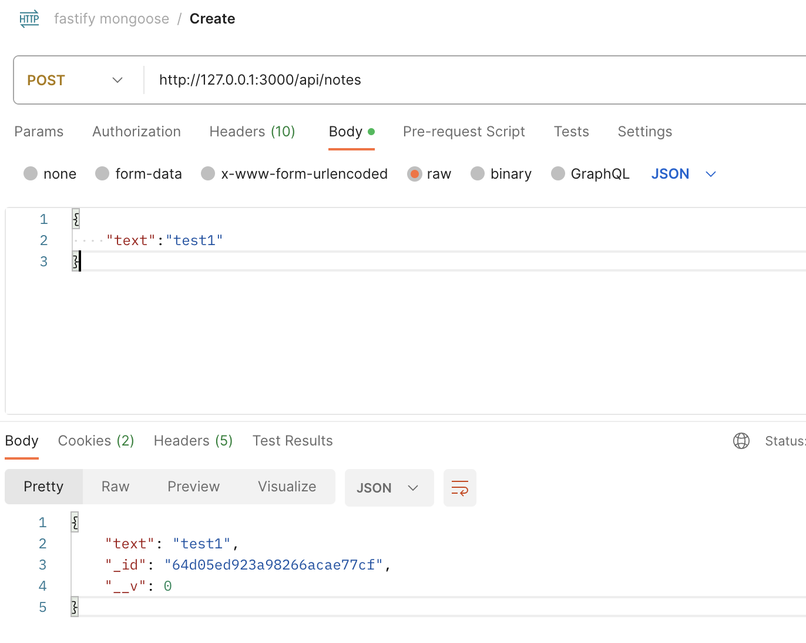

### Fastify Mongoose
#### entry point: index.js
#### controllers
#### models
#### routes

### Run command
```nodejs
node index.js
```

#### POSTMAN
##### Create
```nodejs
{
    "text":"test1"
}
```


